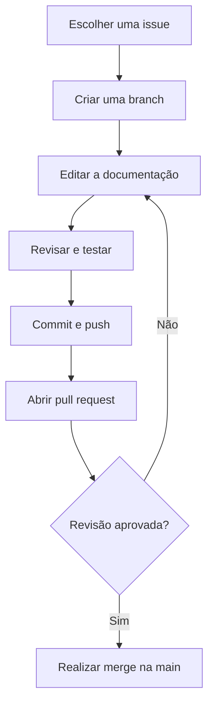

# Desafio Colaborativo

## Sumário

- [Sobre o Projeto](#sobre-o-repositório)

- [Fluxo de Trabalho da Documentação](#fluxo-de-trabalho-da-documentação)

- [Como Contribuir](#como-participar)

- [Recursos & Ferramentas Úteis](#recursos--ferramentas-úteis)

## Sobre o repositório
Repositório para praticar colaboração, controle de versão e revisão de documentos usando Git e GitHub.
Este repositório funciona como um laboratório prático para exercitar colaboração assíncrona e o fluxo de trabalho com Pull Requests. Através de contribuições organizadas, você vivenciará os principais conceitos de versionamento e revisão de código em um ambiente colaborativo.

### Escopo da prática

- Colaboração assíncrona entre múltiplos contribuidores.
- Prática do fluxo Git: branches, commits e pull requests.
- Revisão de código e feedback construtivo.
- Padronização de documentação e estilo de escrita.

### Fora do escopo

- Desenvolvimento de software ou código executável.
- Discussões não relacionadas ao desafio.
- Alterações que não seguem o guia de estilo definido.

## Perguntas Frequentes (FAQ)

<details>
  <summary>Como funciona o fluxo de aprovação de PRs?</summary>
  <p>Cada Pull Request precisa ser revisado e aprovado por pelo menos um integrante do grupo antes de ser mesclado na branch main.</p>
</details>

<details>
  <summary>Como proceder em caso de conflitos de merge?</summary>
  <p>Caso ocorra um conflito, o responsável pela branch deve atualizar sua branch com as alterações mais recentes da main, resolver as inconsistências localmente e realizar um novo push.</p>
</details>

<details>
  <summary>Quais são os horários de alinhamento do grupo?</summary>
  <p>Nossos alinhamentos síncronos acontecem às terças e quintas-feiras, às 14h, via Discord/Google Meet.</p>
</details>

## Objetivo

Manter um documento colaborativo organizado, consistente e fácil de revisar. Cada contribuição deve seguir o padrão de escrita definido neste guia.

[Voltar ao topo](#desafio-colaborativo)

## Como Participar

1. Consulte as issues e escolha uma tarefa disponível.
2. Crie uma branch para a sua alteração.
3. Edite o documento seguindo o guia de estilo.
4. Revise o conteúdo e teste os links adicionados.
5. Registre a alteração em um commit objetivo.
6. Abra um pull request para discussão e revisão.

### Comandos básicos

```bash
git clone https://github.com/Lettify/desafio-colaborativo-git.git
cd desafio-colaborativo-git
git switch -c nome-da-branch
git add README.md
git commit -m "docs: atualiza documentação"
git push -u origin nome-da-branch
```

## Fluxo de Trabalho da Documentação



### Legenda do fluxo

- **Escolher uma issue:** selecione uma tarefa ou dúvida registrada no repositório.
- **Criar uma branch:** trabalhe isoladamente para manter a `main` estável.
- **Editar a documentação:** faça a alteração seguindo o guia de estilo.
- **Revisar e testar:** confira o texto, a formatação e o funcionamento dos links.
- **Commit e push:** registre a mudança e envie a branch para o GitHub.
- **Abrir pull request:** apresente a alteração para análise dos demais integrantes.
- **Revisão aprovada?:** se houver ajustes, atualize a branch e reenvie a alteração.
- **Realizar merge na main:** integre a contribuição aprovada ao documento principal.

## Guia de Estilo do Documento

### Hierarquia de cabeçalhos

- `#` deve ser usado uma única vez, exclusivamente no título principal.
- `##` deve identificar as grandes seções do documento.
- `###` deve identificar subtópicos dentro de uma seção.

### Padrões de sintaxe

- Use listas não ordenadas com `-`, sem misturar `*` ou `+`.
- Deixe uma linha em branco antes e depois de parágrafos, listas e blocos de código.
- Identifique a linguagem em todo bloco de código, como `bash`, `python` ou `markdown`.
- Use textos de link objetivos e descrições que expliquem a finalidade do destino.
- Prefira frases curtas e revise ortografia, pontuação e concordância.

### Exemplo recomendado

````markdown
## Etapa 1: Preparação

Leia as instruções antes de iniciar a edição.

- Confira a issue relacionada.
- Crie uma branch para a tarefa.
````

### Exemplo a evitar

````markdown
### Etapa 1: Preparação
Texto colado sem espaçamento
* Item 1
* Item 2
\`\`\`
````

## Checklist de Revisão

- [ ] O título e os cabeçalhos seguem a hierarquia definida.
- [ ] As listas usam o marcador `-`.
- [ ] Existe uma linha em branco entre os blocos.
- [ ] Os blocos de código informam a linguagem.
- [ ] Os links têm descrições claras e estão funcionando.
- [ ] O texto foi revisado antes do pull request.

[Voltar ao topo](#desafio-colaborativo)

## Recursos & Ferramentas Úteis

### Referências de Markdown

| Recurso | Finalidade |
| --- | --- |
| [Markdown Guide](https://www.markdownguide.org/basic-syntax/) | Consulta rápida da sintaxe básica de Markdown. |
| [Sintaxe do GitHub](https://docs.github.com/en/get-started/writing-on-github/getting-started-with-writing-and-formatting-on-github) | Consulta dos recursos de formatação compatíveis com o GitHub. |

### Visualizadores de Git

| Recurso | Finalidade |
| --- | --- |
| [Learn Git Branching](https://learngitbranching.js.org/) | Simulação interativa de branches, commits, merges e rebases. |
| [Visualizing Git](https://git-school.github.io/visualizing-git/) | Visualização do histórico e dos efeitos dos comandos Git. |

### Simuladores de Terminal

| Recurso | Finalidade |
| --- | --- |
| [JSLinux](https://bellard.org/jslinux/) | Experimentação com sistemas Linux e comandos diretamente no navegador. |
| [Webminal](https://www.webminal.org/) | Prática de comandos Linux em um terminal online. |

### Atalhos do Repositório

| Recurso | Finalidade |
| --- | --- |
| [Código do projeto](https://github.com/Lettify/desafio-colaborativo-git) | Acesso aos arquivos, branches e informações gerais do desafio. |
| [Issues](https://github.com/Lettify/desafio-colaborativo-git/issues) | Registro e acompanhamento de tarefas, dúvidas e problemas. |
| [Pull requests](https://github.com/Lettify/desafio-colaborativo-git/pulls) | Revisão e discussão das alterações antes da integração. |
| [Histórico de commits](https://github.com/Lettify/desafio-colaborativo-git/commits/main/) | Consulta das alterações realizadas na branch principal. |

[Voltar ao topo](#desafio-colaborativo)
